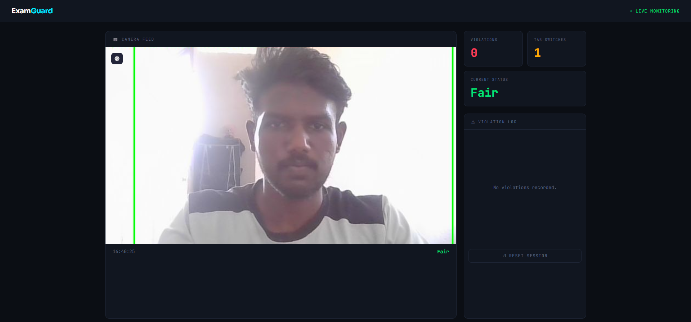

# 🎓 AI-Powered Online Examination Proctoring System (ExamGuard)



An **AI-based online exam monitoring system** that detects potential malpractice during remote examinations using **Computer Vision and YOLOv8 object detection**.  
The system streams the webcam feed, analyzes frames in real time, detects suspicious objects or behavior, and logs violations with timestamps.

This project simulates the **core functionality of modern AI proctoring platforms** used in online assessments.

---

# 🚀 Features

### 📹 Live Camera Monitoring
- Real-time webcam stream
- Frames processed continuously by the AI model

### 🤖 AI Malpractice Detection
Detects suspicious objects using **YOLOv8**:

- 📱 Mobile Phone
- 💻 Laptop
- 📚 Book
- 📺 Remote device

### 👤 Person Detection Rules
The system checks:

- No person detected
- Multiple persons detected

If any rule is violated → **Malpractice Alert**

### 📝 Violation Logging
Each violation is recorded with:

- Timestamp
- Reason for violation
- Evidence screenshot

### 🔁 Tab Switch Monitoring
Detects when a student switches browser tabs during the exam.

### 📊 Live Dashboard
Displays:

- Current exam status
- Total violations
- Tab switches
- Violation history

### 🔄 Session Reset
Admins can reset the monitoring session instantly.

---

# 🖼 Demo

Below is the monitoring interface used during the exam session.


---

# 🧠 Technologies Used

| Technology | Purpose |
|-------------|-------------|
| Python | Core programming language |
| FastAPI | Backend web framework |
| OpenCV | Image processing |
| YOLOv8 | Object detection model |
| cvzone | Bounding box utilities |
| Jinja2 | HTML template rendering |
| JavaScript | Frontend interactions |

---

# 📂 Project Structure
<pre>
examguard-ai-proctoring
│
├── app.py # FastAPI server
├── detector.py # AI detection logic
├── yolov8n.pt # YOLO model weights
│
├── templates/
│ └── index.html # Frontend dashboard
│
├── docs/
│ └── demo.png # README screenshot
│
├── requirements.txt
└── README.md
</pre>

---


---

# ⚙️ Installation

## 1️⃣ Clone Repository

```bash
git clone https://github.com/yourusername/examguard-ai-proctoring.git
cd examguard-ai-proctoring

